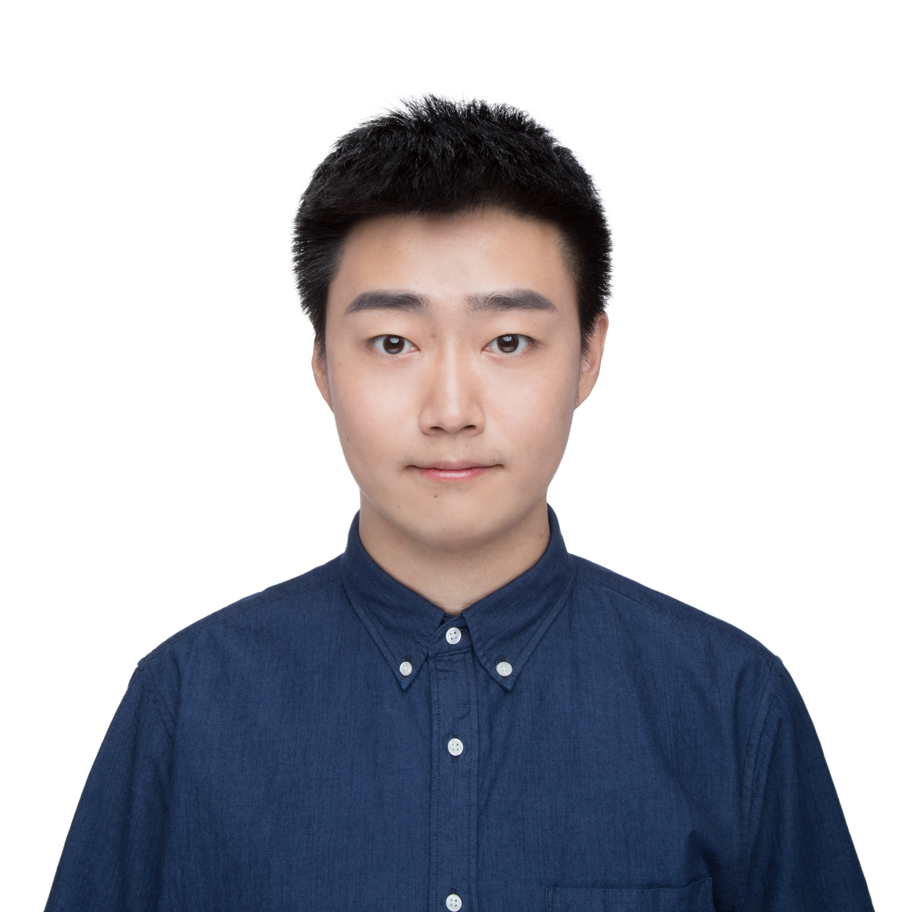

## Shengzhe Xu 徐圣喆

I am a PHD student in the Department of Computer Science of Virginia Tech.

**Contact Information**  
Email:  shengzx@vt.edu  
Github Algorithm Blog: [summer-meet.github.io](http://summer-meet.github.io)  
Office: 4B Knowledge Works II UPSTAIRS  
TA Office hour: CS3114 Data Structure and Algorithm, 104 McB Hall, Monday 12:00pm - 2:00pm & Tuesday 11:00am - 1:00 pm.

## Research Interest

My research interests include **Programming Languages**, **Software Engineering** and **Machine Learning**.

My research passion is on improvement of programming languages that relating with machine learning. By introducing more minimal and higher accuracy probabilistic languages, build a better environment that usual developers can get benefit on reducing their development barriers.

## Education

Degree|Discipline      |Year| Uiversity
------|----------------|----|---------
Ph.D  |Computer Science|now |Virginia Tech (Supervisor Na Meng)
B.A.  |Telecommunication with management| 2012 | Beijing University of Post and Telecommunication

## Awards

Year | Award          | Category
-----|----------------|--------
2014 | ACM-ICPC       | Won Silver medalist in Asia Regional Contest
2014 | Google Code Jam| Received full marks in Preliminaries C round and qualified for the semi-final.

---

## References

* Na Meng: Associate Professor, Department of Computer Science, Virginia Tech.
